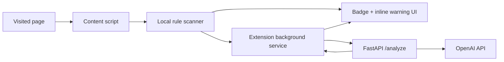

# AI Phishing Detection Browser Extension Design

## Goal

Build a Chrome and Firefox browser extension that detects suspicious phishing pages, highlights risky login forms, and uses AI-assisted analysis to explain likely threats without sending credentials to the backend.

The first version must prioritize user trust and satisfaction. It should feel calm, useful, fast, and transparent rather than intrusive or alarmist.

## Confirmed Decisions

- Browser support: Chrome and Firefox.
- Extension model: browser extension with a compatibility wrapper for browser APIs.
- Backend: FastAPI.
- AI provider: OpenAI API from the backend only.
- Credential handling: `OPENAI_API_KEY` is stored locally in `.env.local` and must never be bundled into extension code.
- ChatGPT web login: not used. The product calls the OpenAI API instead of automating a ChatGPT browser session.
- Warning behavior for MVP: passive badge plus inline warnings near suspicious login forms.
- Submit blocking: out of scope for MVP; can be added later as a hardening feature.

## User Experience Requirements

The extension must help users make better security decisions without making normal browsing frustrating.

- Use calm, plain language such as "This login form looks suspicious" instead of dramatic scare copy.
- Show clear, short reasons users can scan quickly.
- Run deterministic local checks immediately so normal pages do not feel slow.
- Add AI-enhanced wording/domain details when backend analysis is available.
- Never send typed credentials, password field values, or full form values to the backend.
- Let users dismiss inline warnings for the current page.
- Let users reopen details from the extension popup.
- Use a polished, trustworthy visual style: neutral surfaces, restrained warning colors, compact typography, and consistent risk levels.

## Architecture



## Extension Components

### Content Script

The content script scans the current page for:

- login forms,
- password fields,
- submit buttons,
- form action hosts,
- visible domain and URL signals,
- suspicious page wording,
- brand impersonation signals.

It injects inline warning UI near risky login forms. The injected UI must avoid breaking host page layout and must use isolated class names.

### Background Service

The background service coordinates analysis requests and updates extension state:

- receives page risk signals from content scripts,
- calls the FastAPI backend,
- stores latest risk result per tab,
- updates the extension badge and popup state,
- handles Chrome and Firefox API differences through a compatibility wrapper.

### Popup UI

The popup shows:

- current risk level: safe, suspicious, or high risk,
- numeric or labeled risk score,
- domain being assessed,
- concise risk reasons,
- whether AI analysis is available or still pending,
- controls to view details or dismiss current page warning.

## Backend Components

### FastAPI API

The backend exposes an analysis endpoint:

- `POST /analyze`

The request contains structured page signals and sanitized visible text excerpts. It must not contain credentials, password values, cookies, local storage, or full page HTML.

The response contains:

- risk level,
- risk score,
- reasons,
- recommended warning copy,
- source labels showing whether a reason came from rules, AI, or both.

### Rule Scoring

The backend includes deterministic scoring before or alongside the OpenAI call. Rule checks should cover:

- suspicious TLDs or excessive subdomains,
- punycode or homograph-like domains,
- brand-like domain impersonation,
- form action domain mismatch,
- urgent credential wording,
- missing HTTPS on credential forms,
- recently configured allowlist or dismiss state if added later.

### OpenAI Analysis

The OpenAI prompt should classify risk from sanitized signals only. It should not receive secret values, typed credentials, cookies, or raw full-page source.

The model output should be constrained to structured JSON so the extension can display stable UI copy.

## Data Privacy

The MVP must follow these privacy boundaries:

- Do not collect passwords or typed credential values.
- Do not send cookies, local storage, session storage, or complete HTML to the backend.
- Send only the current URL/domain, form metadata, action host, field type metadata, and selected visible text snippets.
- Display enough explanation for users to understand why a warning appeared.
- Keep `.env.local` ignored by git.

## Testing Strategy

### Extension Tests

- Detects password/login forms.
- Detects action host mismatch.
- Produces local risk signals from suspicious wording.
- Renders inline warning for suspicious forms.
- Does not render warning for clearly safe fixture pages.
- Updates popup state from background risk result.
- Uses browser compatibility wrapper rather than direct Chrome-only calls in shared logic.

### Backend Tests

- `/analyze` accepts sanitized page signals.
- Rule scorer assigns higher risk to brand impersonation and form-action mismatch.
- OpenAI adapter can be mocked for stable tests.
- Response shape is valid and safe for popup rendering.
- Input validation rejects credential-like payload fields.

### Manual Verification

- Load unpacked extension in Chrome.
- Load temporary extension in Firefox.
- Visit fixture safe login page.
- Visit fixture suspicious login page.
- Confirm badge status, popup detail, and inline warning behavior.
- Confirm no credential values are transmitted.

## Initial Project Structure

```text
extension/
  manifest.chrome.json
  manifest.firefox.json
  src/
    background/
    content/
    popup/
    shared/
backend/
  app/
    main.py
    models.py
    rules.py
    openai_client.py
  tests/
docs/
  superpowers/specs/
```

## Out Of Scope For MVP

- Blocking form submission.
- Real-time password field inspection.
- Enterprise admin dashboards.
- Cloud deployment.
- User accounts.
- Browser store publishing.
- Known-phishing feed ingestion.

## Future Enhancements

- Optional submit gate for high-risk credential submissions.
- Local LLM provider option.
- User-managed allowlist and blocklist.
- Phishing report export.
- Hosted backend deployment.
- Browser store packaging and signing.
